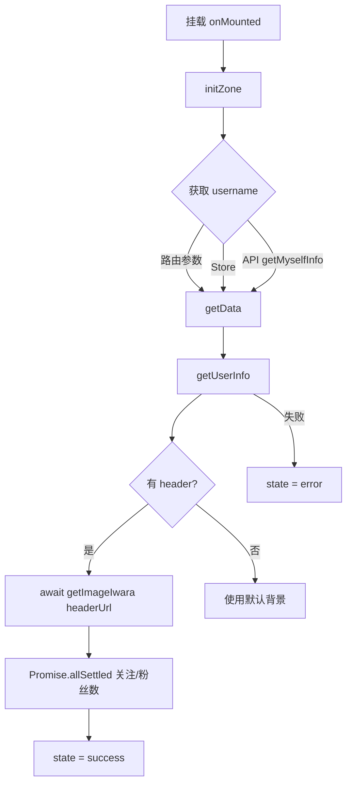
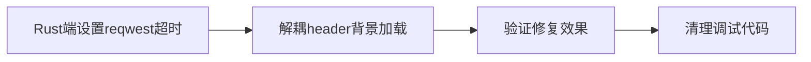

# Zone 页面一直加载问题分析与修复计划

## 问题描述

[`src/views/zone.vue`](src/views/zone.vue) 页面进入后一直显示加载状态（`loadingHuawu` 组件），无法正常显示用户主页内容。

## 根因分析

### 加载状态流转

页面定义了三种状态：`'loading'`（初始）→ `'success'`（成功）或 `'error'`（失败）。



### 核心问题：`getImageIwara` 请求可能永远不返回

在 [`src/views/zone.vue:346-355`](src/views/zone.vue:346) 中：

```typescript
if (res.data.header) {
  try {
    const headerUrl = `https://i.iwara.tv/image/profileHeader/${res.data.header.id}/${res.data.header.name}`;
    const bgImageUrl = await getImageIwara(headerUrl);  // ← 潜在挂起点
    zoneBgStyle.value = `...`;
  } catch (error) {
    // 仅捕获异常，不处理 Promise 永不返回的情况
    zoneBgStyle.value = defaultBgStyle;
  }
}
```

[`getImageIwara()`](src/core/api/iwara.ts:180) 内部调用 Tauri 命令 `invoke('send_https_request_binary', ...)`：

```typescript
const response: any = await invoke('send_https_request_binary', { params: { url, method: 'GET', headers } });
```

如果：
1. Iwara 的图片 CDN（`i.iwara.tv`）不可达或响应超时
2. Tauri IPC 通信出现问题，Rust 端没有返回结果
3. 网络请求在 Rust 层 hang 住（reqwest 默认没有超时设置）

**则 Promise 永远不会 resolve/reject，导致 await 之后的代码永远不会执行，`state` 永远停留在 `'loading'`。**

### 根因 1：Rust 端 reqwest 客户端没有设置超时

查看 [`src-tauri/src/network.rs:38`](src-tauri/src/network.rs:38)：

```rust
let client = reqwest::Client::new();
```

`reqwest::Client::new()` 默认**没有请求超时**。默认的 timeout 是 `None`，意味着连接和读取都可能无限等待。这在网络不稳定或 CDN 不可达时会导致请求永久挂起。

### 根因 2：前端 `getImageIwara` 没有超时机制

即使 Rust 端后续加了超时，前端也应该有兜底超时机制，防止：
- Tauri IPC 层异常
- Rust 端改了但部署版本未更新
- 其他不可预见的挂起场景

### 根因 3：`getUserFollowers` 和 `getUserFans` 请求量大可能慢

这两个请求分别调用 [`/user/{uid}/following`](src/core/api/user.ts:37) 和 [`/user/{uid}/followers`](src/core/api/user.ts:52)，返回的是完整的关注/粉丝列表（不是简单的计数）。如果用户关注/粉丝很多，响应体可能很大，导致请求缓慢。

不过它们被包在 [`Promise.allSettled`](src/views/zone.vue:360) 中，即使失败也会触发 `.finally(() => state = 'success')`，所以不是主要问题。

## 修复方案

### 方案 A：前端添加 `getImageIwara` 超时包装（推荐，最小侵入）

**改动范围**：[`src/core/api/iwara.ts`](src/core/api/iwara.ts)

在 `getImageIwara` 中添加超时机制，使用 `AbortController` 或 `Promise.race`：

```typescript
export async function getImageIwara(url: string, timeoutMs = 15000): Promise<string> {
  const timeoutPromise = new Promise<never>((_, reject) => 
    setTimeout(() => reject(new Error('Image request timeout')), timeoutMs)
  );
  const fetchPromise = (async () => {
    // ... 现有逻辑
  })();
  return Promise.race([fetchPromise, timeoutPromise]) as Promise<string>;
}
```

或者更简单的方案：在 `invoke` 层面用 `Promise.race` 加超时。

### 方案 B：Rust 端给 reqwest 客户端设置超时

**改动范围**：[`src-tauri/src/network.rs`](src-tauri/src/network.rs)

给 `reqwest::Client` 加上连接超时和总超时：

```rust
let client = reqwest::Client::builder()
    .timeout(std::time::Duration::from_secs(30))  // 总超时
    .connect_timeout(std::time::Duration::from_secs(15)) // 连接超时
    .build()
    .map_err(|e| format!("Failed to build HTTP client: {}", e))?;
```

### 方案 C：解耦 header 背景图加载，不阻塞状态流转

**改动范围**：[`src/views/zone.vue`](src/views/zone.vue)

将 header 背景图加载从 `getData()` 的同步阻塞改为后台加载，不影响 state 切换：

```typescript
// 不再 await getImageIwara
loadHeaderBackground(res.data.header).catch(() => {});

// 单独的函数
async function loadHeaderBackground(header: any) {
  // ... 加载逻辑，失败不阻塞
}
```

这样即使背景图加载慢或失败，页面内容也能正常显示。

### 推荐方案：方案 B + 方案 C 组合

| 方案 | 优点 | 缺点 |
|------|------|------|
| **B: Rust 端超时** | 从根本上解决所有请求挂起问题 | 需要重新编译 Rust 后端 |
| **C: 解耦背景加载** | 不阻塞页面状态，体验更好 | 背景可能延迟显示 |
| A: 前端超时 | 快速实现，无需编译 Rust | 治标不治本，其他 API 仍可能挂起 |

**建议同时实施方案 B 和方案 C**：
- 方案 B 解决所有 Tauri HTTP 请求的潜在挂起问题（一次性根治）
- 方案 C 确保页面核心内容不受背景图片加载影响（体验优化）

## 执行步骤



1. **Rust 端修复**：[`src-tauri/src/network.rs`](src-tauri/src/network.rs)
   - 为 `reqwest::Client` 设置 `timeout(30s)` 和 `connect_timeout(15s)`
   - 确保所有请求（包括 `send_https_request` 和 `send_https_request_binary`）都使用带超时的客户端

2. **前端修复**：[`src/views/zone.vue`](src/views/zone.vue)
   - 将 header 背景图片加载从 `getData()` 的主流程中分离
   - 改为后台异步加载，不阻塞 `state` 状态更新
   - 同时给 `getImageIwara` 调用加上超时兜底

3. **验证**：
   - 模拟网络断开或 CDN 不可达场景
   - 确认页面能正常显示（即使背景图加载失败）
   - 确认所有状态切换正常
